# 📋 Casos de Uso - Sistema Wastech

> Plataforma inteligente para la gestión y monitoreo de procesos de deshidratación de residuos orgánicos mediante tecnologías IoT.

---

# 🎭 Actores del Sistema

| Actor               | Descripción                           |
| ------------------- | ------------------------------------- |
| 👨‍💼 Administrador | Gestiona completamente el sistema     |
| 👤 Cliente          | Consulta y monitorea sus procesos     |
| 🤖 Arduino          | Envía información de sensores         |
| 🌡️ Sensor          | Genera datos de temperatura y humedad |

---

# 🏗️ Visión General del Sistema

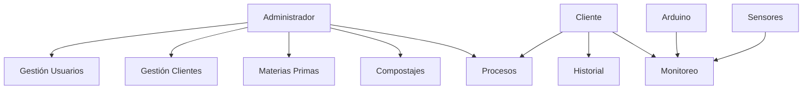

---

# 🔐 Caso de Uso: Iniciar Sesión

## Objetivo

Permitir el acceso seguro al sistema.

## Actores

* Administrador
* Cliente

## Flujo Principal

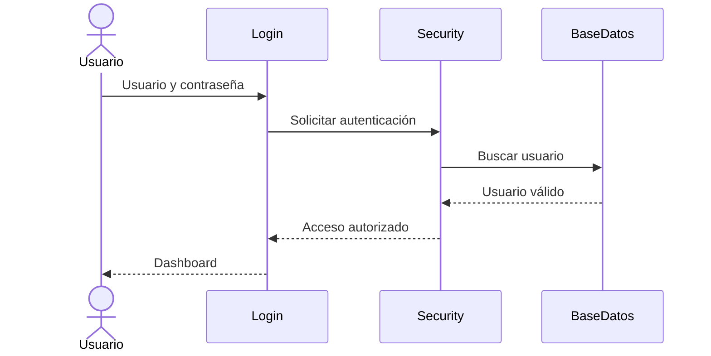

---

# 👥 Caso de Uso: Gestionar Usuarios

## Actor

Administrador

## Objetivo

Administrar las cuentas del sistema.

## Funcionalidades

* Crear usuario
* Editar usuario
* Eliminar usuario
* Consultar usuario

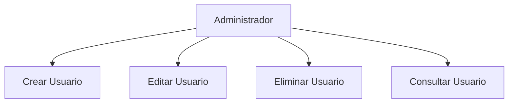

---

# 🧑‍💼 Caso de Uso: Gestionar Clientes

## Actor

Administrador

## Objetivo

Administrar los clientes registrados.

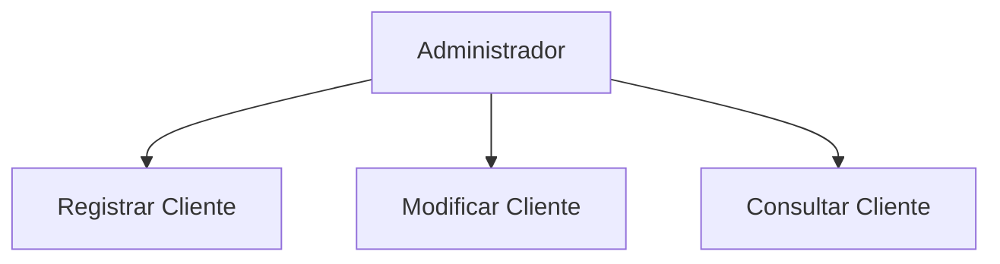

---

# 🌱 Caso de Uso: Gestionar Materia Prima

## Actor

Administrador

## Objetivo

Registrar materiales que serán procesados.

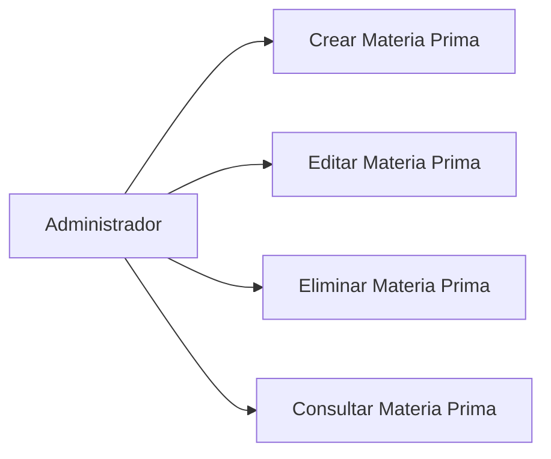

---

# ♻️ Caso de Uso: Gestionar Compostaje

## Actor

Administrador

## Objetivo

Configurar parámetros de compostaje.

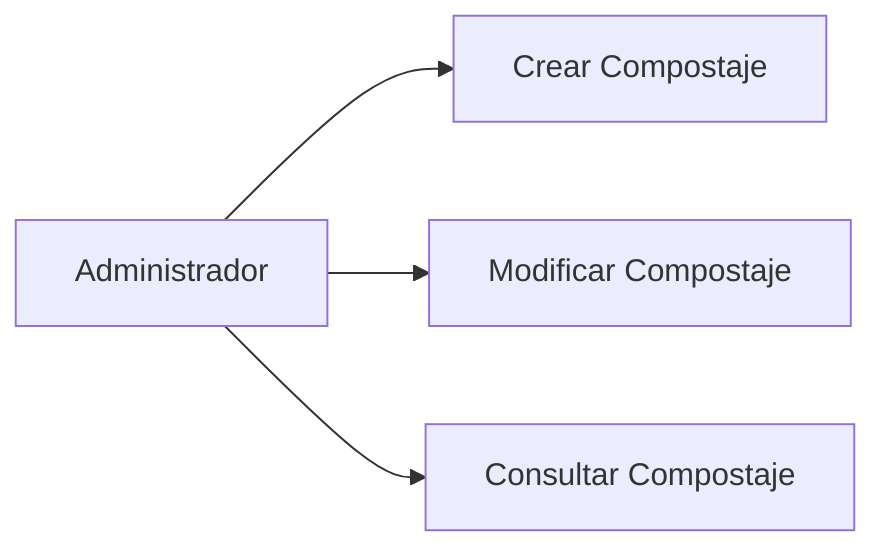

---

# 🔥 Caso de Uso Principal: Crear Proceso de Deshidratación

## Actores

* Administrador
* Cliente

## Objetivo

Iniciar un proceso de deshidratación.

## Flujo

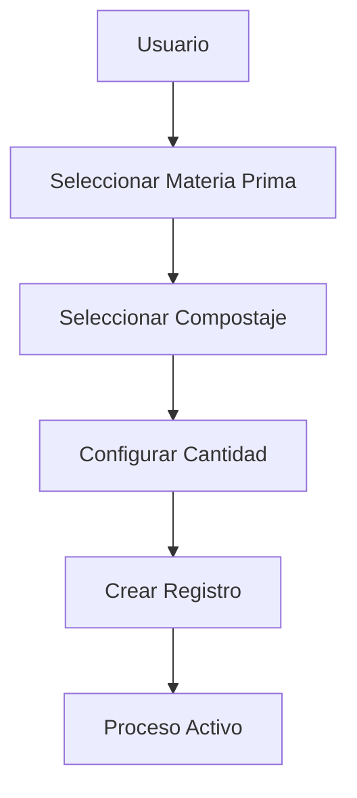

---

# 🌡️ Caso de Uso: Monitorear Temperatura y Humedad

## Actores

* Cliente
* Arduino

## Objetivo

Visualizar variables del proceso.

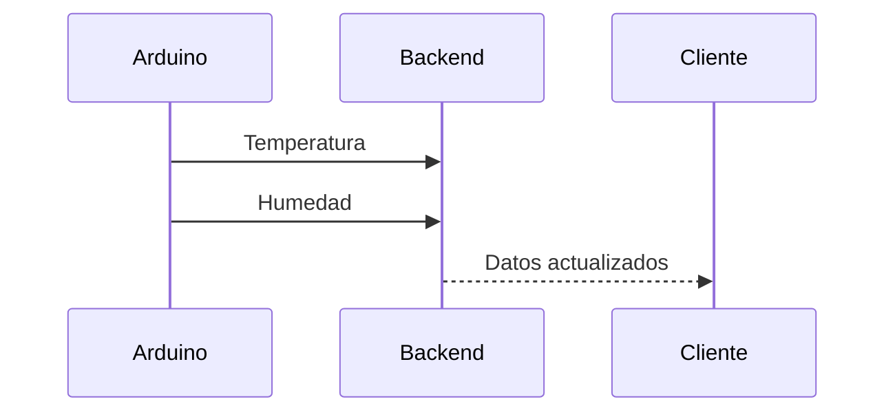

---

# 📊 Caso de Uso: Consultar Historial

## Actor

Cliente

## Objetivo

Consultar procesos realizados.

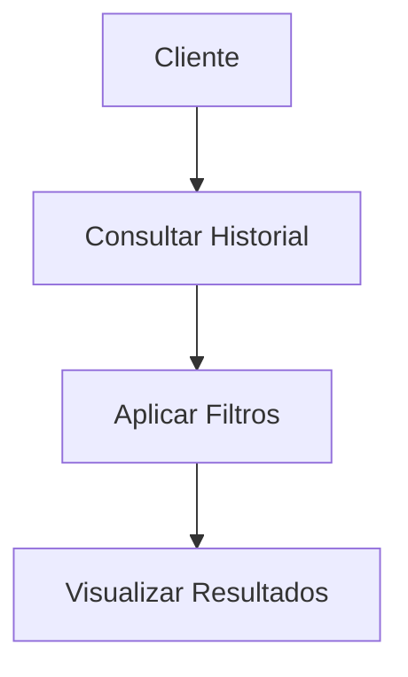

---

# ⚙️ Caso de Uso: Controlar Deshidratador

## Actor

Cliente

## Objetivo

Encender o apagar el equipo.

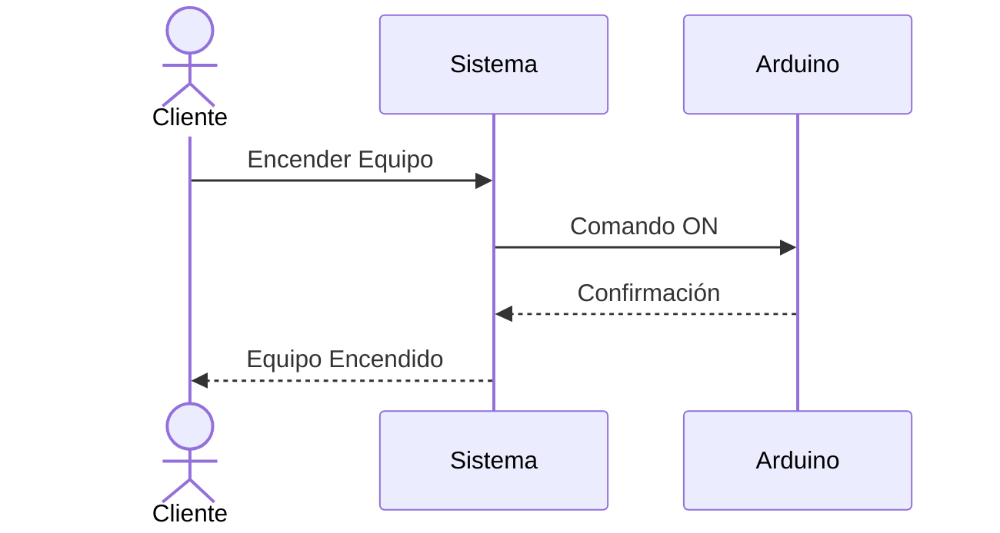

---

# 📄 Caso de Uso: Generar Reporte PDF

## Actor

Cliente

## Objetivo

Descargar información histórica.

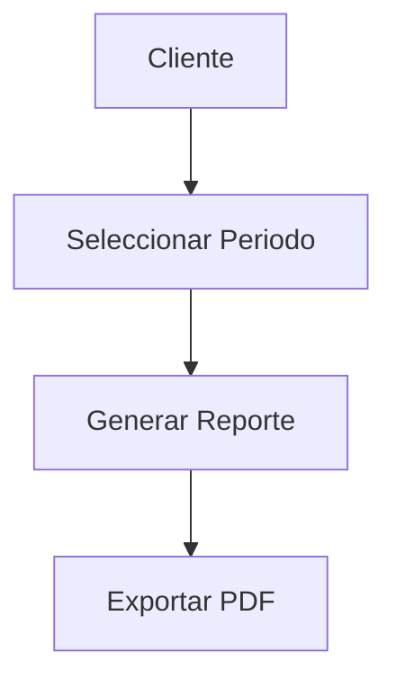

---

# 🔄 Flujo Completo del Negocio

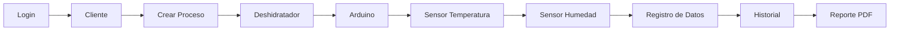

---

# 🎯 Casos de Uso Prioritarios del MVP

| Prioridad | Caso de Uso               |
| --------- | ------------------------- |
| 🔴 Alta   | Iniciar Sesión            |
| 🔴 Alta   | Gestionar Usuarios        |
| 🔴 Alta   | Gestionar Clientes        |
| 🔴 Alta   | Gestionar Materias Primas |
| 🔴 Alta   | Gestionar Compostajes     |
| 🔴 Alta   | Crear Proceso             |
| 🔴 Alta   | Consultar Historial       |
| 🟡 Media  | Monitorear Sensores       |
| 🟡 Media  | Controlar Deshidratador   |
| 🟢 Baja   | Generar PDF               |
| 🟢 Baja   | Notificaciones            |

---

# 🏁 Alcance del MVP

El MVP del sistema Wastech deberá permitir:

✅ Autenticación de usuarios

✅ Gestión de usuarios y clientes

✅ Configuración de materia prima

✅ Configuración de compostajes

✅ Creación de procesos de deshidratación

✅ Consulta de historial

✅ Recepción de datos IoT

✅ Visualización de temperatura y humedad

---

**Proyecto:** Wastech

**Versión:** 1.0

**Tipo de Documento:** Casos de Uso
